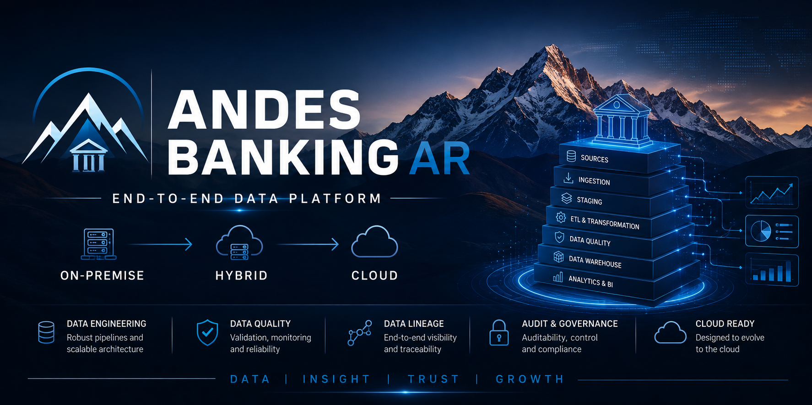
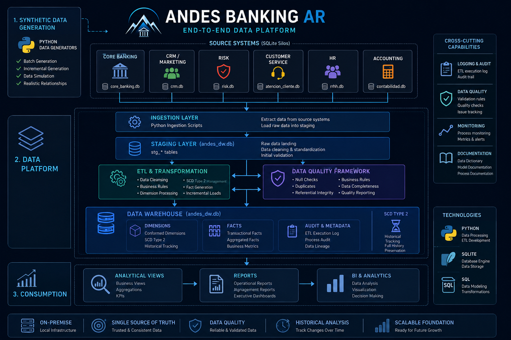

<p align="center">
  
</p>

# 🏦 Andes Banking AR

**Data Warehouse on-premise para un banco simulado, construido con Python y SQLite.**


## 🎯 El proyecto en 30 segundos

**Andes Banking AR** es un caso de estudio de **Data Engineering end-to-end** que simula la construcción y evolución de una plataforma de datos para un banco tradicional argentino.

El proyecto parte de múltiples sistemas operacionales simulados y construye un flujo completo de datos:

**Generación de datos → Fuentes operacionales → Ingestión → Staging → ETL → Data Quality → Data Warehouse → Analytics**

### ¿Qué demuestra?

* 🏦 **Integración de múltiples dominios bancarios** en una plataforma centralizada.
* 🐍 **Generación de datos sintéticos** batch e incrementales para simular una operación bancaria continua.
* 🔄 **Procesos ETL** para extracción, transformación, limpieza y carga.
* 🗃️ **Data Warehouse dimensional** basado en principios de modelado Kimball.
* 🧬 **SCD Type 2** para conservar el historial de cambios en dimensiones.
* 🛡️ **Data Quality Framework** para detectar errores, inconsistencias y problemas de integridad.
* 📝 **Auditoría y trazabilidad** de los procesos de carga.
* ☁️ **Arquitectura preparada para evolucionar** desde un entorno on-premise hacia una plataforma híbrida y cloud.

> **Objetivo:** demostrar cómo una organización puede evolucionar desde datos distribuidos y sistemas operacionales independientes hacia una plataforma de datos centralizada, confiable y preparada para análisis.

## 📖 Descripción

Andes Banking AR es un proyecto educativo que simula la modernización de datos de un banco tradicional argentino. La fase on-premise implementa un **Data Warehouse central** que integra datos de seis áreas departamentales:

- 🟢 Core Bancario
- 🟠 CRM / Marketing
- 🔴 Riesgos
- 🟡 Atención al Cliente
- 🔵 RRHH
- ⚫ Contabilidad

Cada área tiene su propia base de datos SQLite (simulando silos transaccionales). Mediante **procesos ETL en Python** se integran en un único Data Warehouse con modelo dimensional Kimball, SCD Tipo 2, limpieza selectiva y auditoría.

## 🏗️ Arquitectura

La plataforma de datos de Andes Banking AR está diseñada como un flujo end-to-end que parte de sistemas operacionales simulados, atraviesa las capas de ingestión, staging, transformación y calidad, y termina en un Data Warehouse preparado para análisis y reporting.

<p align="center">
  
</p>


- **Generadores batch** crean datos sintéticos con errores intencionales.
- **Generadores diarios incrementales** simulan la operación bancaria real.
- **ETL** extrae, transforma y carga los datos en el DW.
- **Framework de calidad** valida staging y DW final.

## 🛠️ Tecnologías

- Python 3.10+
- SQLite 3.x
- Windows CMD
- Git / GitHub

## 📁 Estructura del repositorio

```
andes-banking-ar/
├── docs/                         # Documentación
├── python/etl/                   # Scripts ETL
├── sql/                          # Scripts SQL (esquemas, vistas, calidad)
├── src/andes_bank/generators/    # Generadores de datos
├── run_all.bat                   # Reconstrucción total
└── README.md
```

## 🚀 Cómo reconstruir el proyecto

1. Clonar el repositorio:
   ```cmd
   git clone https://github.com/AutodidactaJr/andes-banking-ar.git
   cd andes-banking-ar
   ```

2. Ejecutar el flujo completo:
   ```cmd
   run_all.bat
   ```

   El batch:
   - Genera datos maestros batch.
   - Carga bases de datos de área.
   - Crea el Data Warehouse.
   - Ejecuta ETL (staging, dimensiones, hechos).
   - Genera datos diarios incrementales.
   - Ejecuta calidad de datos final.

3. Verificar resultados:
   ```
   Data Warehouse final: 0 problemas de calidad.
   ```

## 🧪 Calidad de datos

El framework de calidad valida tanto **staging** (errores crudos esperados) como el **Data Warehouse final** (debe tener 0 problemas). Reglas incluyen:

- Nulos en campos críticos
- Duplicados
- Saldos negativos en cajas de ahorro
- Montos cero en transacciones
- Referencias inexistentes

## 📚 Documentación

- [Modelo de datos](docs/modelo_datos.md)
- [Narrativa de evolución](docs/narrativa_evolucion_etl.md)
- [Linaje de datos](docs/linaje_datos.md)
- [Guía de reconstrucción](docs/guia_reconstruccion.md)
- [Tablas omitidas](docs/tablas_omitidas.md)
- [SQL Server + SSIS](docs/sql_server_ssis.md)
- [Arquitectura AWS](docs/migracion_aws_arquitectura.md)

## 👤 Autor

**AutodidactaJr**  
GitHub: [https://github.com/AutodidactaJr](https://github.com/AutodidactaJr)

## 📝 Licencia

Este proyecto es de uso educativo. Los datos son sintéticos y no representan información real de clientes.
