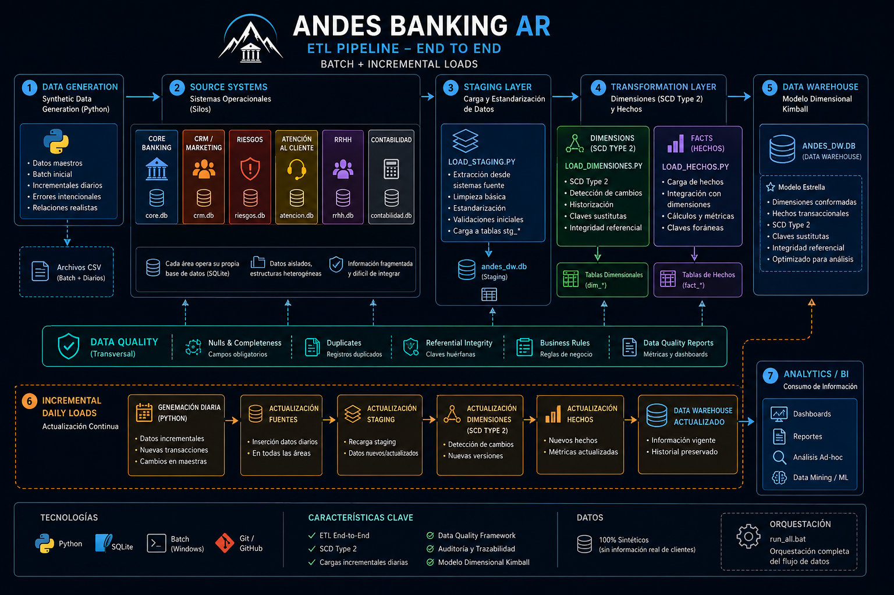
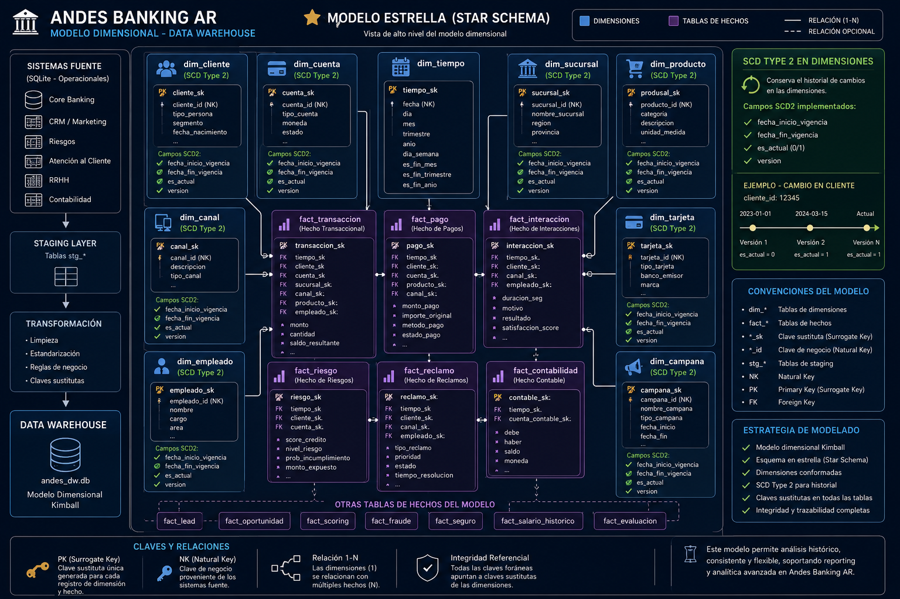
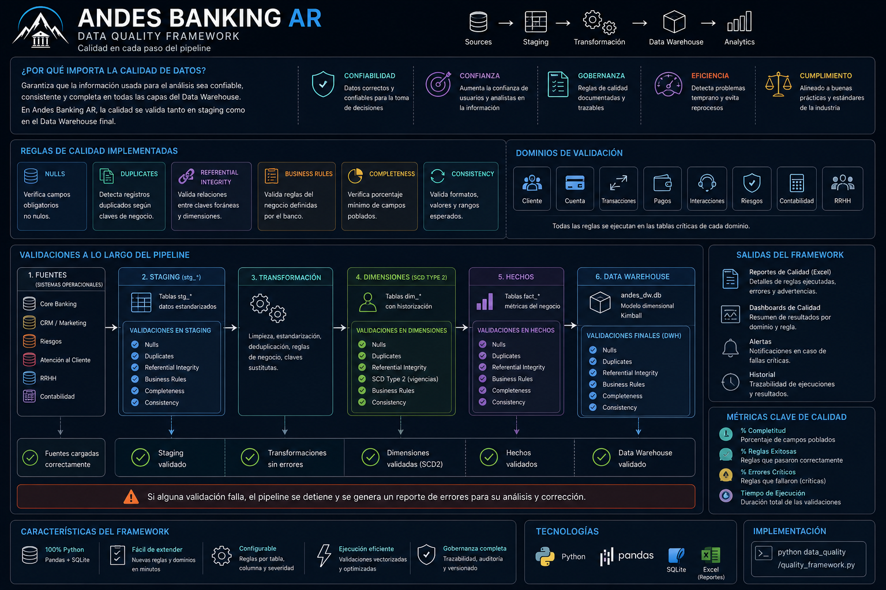

<p align="center">
  
</p>

# 🏦 Andes Banking AR

**End-to-End Data Platform para simular la evolución de datos de un banco tradicional argentino.**


## 🎯 El proyecto en 30 segundos

**Andes Banking AR** es un caso de estudio de **Data Engineering end-to-end** que simula la construcción y evolución de una plataforma de datos para un banco tradicional argentino.

El proyecto parte de múltiples sistemas operacionales simulados y construye un flujo completo de datos:

**Generación de datos → Fuentes operacionales → Ingestión → Staging → ETL → Data Quality → Data Warehouse → Analytics**

### ¿Qué demuestra?

* 🏦 **Integración de múltiples dominios bancarios** en una plataforma centralizada.
* 🐍 **Generación de datos sintéticos** batch e incrementales para simular una operación bancaria continua.
* 🔄 **Procesos ETL** para extracción, transformación, limpieza y carga.
* 🗃️ **Data Warehouse dimensional** basado en principios de modelado Kimball.
* 🧬 **SCD Type 2** para conservar el historial de cambios en dimensiones.
* 🛡️ **Data Quality Framework** para detectar errores, inconsistencias y problemas de integridad.
* 📝 **Auditoría y trazabilidad** de los procesos de carga.
* ☁️ **Arquitectura preparada para evolucionar** desde un entorno on-premise hacia una plataforma híbrida y cloud.

> **Objetivo:** demostrar cómo una organización puede evolucionar desde datos distribuidos y sistemas operacionales independientes hacia una plataforma de datos centralizada, confiable y preparada para análisis.

## 💼 Problema de negocio

Andes Bank representa un banco tradicional con información distribuida entre múltiples áreas operacionales. Cada dominio genera y administra sus propios datos, dificultando la consolidación de información y el análisis integral del negocio.

### El desafío

La organización necesita transformar datos aislados en información confiable y centralizada para facilitar:

* 📊 **Reporting y análisis** del negocio.
* 🕒 **Análisis histórico** de clientes y operaciones.
* 🔍 **Trazabilidad y auditoría** de los procesos de datos.
* 🛡️ **Detección de errores e inconsistencias** antes de consumir la información.
* 🔗 **Integración de múltiples dominios** en una única plataforma.

### La solución

Andes Banking AR construye una plataforma de datos end-to-end que integra los distintos dominios operacionales, aplica procesos de ingestión, transformación y validación, y consolida la información en un **Data Warehouse dimensional** preparado para análisis y reporting.

## 📖 Descripción

Andes Banking AR es un proyecto educativo que simula la modernización de datos de un banco tradicional argentino. La fase on-premise implementa un **Data Warehouse central** que integra datos de seis áreas departamentales:

- 🟢 Core Bancario
- 🟠 CRM / Marketing
- 🔴 Riesgos
- 🟡 Atención al Cliente
- 🔵 RRHH
- ⚫ Contabilidad

Cada área tiene su propia base de datos SQLite (simulando silos transaccionales). Mediante **procesos ETL en Python** se integran en un único Data Warehouse con modelo dimensional Kimball, SCD Tipo 2, limpieza selectiva y auditoría.

## 🏗️ Arquitectura

La plataforma de datos de Andes Banking AR está diseñada como un flujo end-to-end que parte de sistemas operacionales simulados, atraviesa las capas de ingestión, staging, transformación y calidad, y termina en un Data Warehouse preparado para análisis y reporting.

<p align="center">
  
</p>

## 🔄 ETL Pipeline

El pipeline de Andes Banking AR procesa datos sintéticos provenientes de múltiples sistemas operacionales simulados y los transforma progresivamente hasta obtener información estructurada en el Data Warehouse.

### Flujo principal

**Generación → Sources → Staging → Transformación → Data Warehouse → Analytics**

<p align="center">
  
</p>

### Carga inicial

La primera ejecución construye el entorno completo:

1. **Generación de datos** — Python crea datos maestros y transaccionales sintéticos.
2. **Carga de fuentes** — Los datos se distribuyen entre los distintos sistemas operacionales SQLite.
3. **Staging** — Se extraen y estandarizan los datos en tablas `stg_*`.
4. **Dimensiones** — Se procesan las dimensiones y la historización mediante SCD Type 2.
5. **Hechos** — Se cargan las tablas de hechos y sus relaciones con las dimensiones.
6. **Data Quality** — Se ejecutan reglas de validación sobre staging y Data Warehouse.

### Cargas incrementales

El proyecto también simula la operación diaria del banco mediante nuevas cargas incrementales.

**Nuevos datos → Actualización de sources → Staging → Dimensiones → Hechos → Data Warehouse actualizado**

Esto permite demostrar un escenario más cercano a una operación real, donde el Data Warehouse no se construye solamente una vez, sino que recibe nuevas versiones de los datos y conserva el historial necesario para el análisis.

## 🗃️ Modelo de datos

Andes Banking AR utiliza un **modelo dimensional basado en Kimball**, diseñado para separar las métricas de negocio de los atributos descriptivos utilizados para analizarlas.

El Data Warehouse organiza la información principalmente en:

- **Dimensiones (`dim_*`)** — describen entidades y contextos del negocio.
- **Hechos (`fact_*`)** — almacenan eventos y métricas medibles.
- **Claves sustitutas (`*_sk`)** — permiten controlar la integración y el historial dentro del Data Warehouse.
- **Claves de negocio (`*_id`)** — mantienen la referencia al identificador proveniente de los sistemas fuente.

<p align="center">
  
</p>

### ⭐ Modelo estrella

Las tablas de hechos se relacionan con dimensiones conformadas para permitir análisis por diferentes perspectivas del negocio, como:

**Cliente · Cuenta · Sucursal · Producto · Tiempo · Canal · Empleado**

Por ejemplo:

```text
                    DIM_CLIENTE
                         │
                         │
DIM_TIEMPO ─────── FACT_TRANSACCION ─────── DIM_CUENTA
                         │
                         │
                    DIM_SUCURSAL
```

## 🛡️ Data Quality

La calidad de los datos se controla a lo largo del pipeline para detectar
errores antes de que la información llegue a las capas de consumo.

<p align="center">
  
</p>
