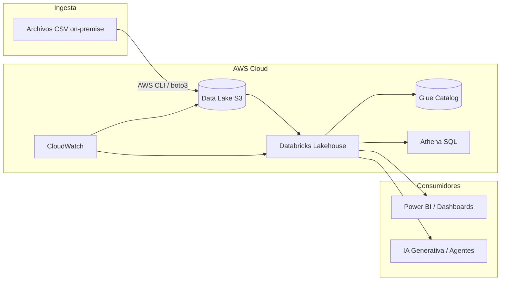
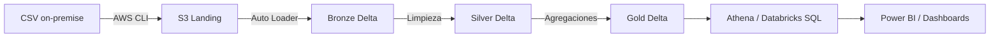

# 📄 Documento de Arquitectura Cloud AWS — Andes Banking AR

**Versión:** 1.0  
**Fecha:** 2026-08-20  
**Autor:** AutodidactaJr  
**Etapa:** Migración a la nube — Fase 1: Diseño de arquitectura

---

## 1. Introducción

La fase on-premise de **Andes Banking AR** cumplió su objetivo: construir un Data Warehouse funcional con SQLite y Python, aplicar modelado dimensional, calidad de datos, SCD Tipo 2 y automatización. Sin embargo, un banco real necesita **escalabilidad, seguridad, gobernanza y analítica avanzada**.

Este documento describe la arquitectura de migración a **AWS**, manteniendo la misma lógica de negocio y aprovechando servicios gestionados en la nube.

### 1.1 ¿Por qué AWS?

- **Escalabilidad elástica:** recursos bajo demanda.
- **Servicios gestionados:** S3, Glue, Athena, IAM, KMS.
- **Integración con Databricks:** Lakehouse con Delta Lake.
- **Capa gratuita:** permite prototipar sin costo.
- **Demanda laboral:** AWS es el proveedor más usado en Data Engineering.

---

## 2. Arquitectura de referencia



### 2.1 Componentes principales

| Componente | Servicio | Función |
|------------|----------|---------|
| **Data Lake** | Amazon S3 | Almacenamiento central de archivos crudos, delta, versionados |
| **Lakehouse** | Databricks | Procesamiento distribuido, transformación, SQL |
| **Catálogo de datos** | AWS Glue Data Catalog | Metadatos técnicos, tablas, esquemas |
| **Consultas SQL** | Amazon Athena | Consultas serverless sobre S3 |
| **Seguridad** | IAM, KMS | Accesos granulares, cifrado |
| **Monitoreo** | CloudWatch | Logs, métricas, alertas |

---

## 3. Servicios AWS detallados

### 3.1 Amazon S3 (Data Lake)

- **Uso:** Almacenar todos los archivos CSV generados en on-premise y las tablas Delta.
- **Estructura de carpetas:**

```
s3://andes-banking-ar-data-lake/
├── landing/        # Archivos crudos recién subidos
├── bronze/         # Datos en formato Delta crudos
├── silver/         # Datos limpios y modelados
└── gold/           # Tablas agregadas para dashboards
```

### 3.2 Databricks (Lakehouse)

- **Uso:** Procesar datos con Spark, construir capas Medallion, ejecutar SQL, alojar dashboards y modelos de ML.
- **Integración con S3:** lee y escribe directamente en S3.
- **Delta Lake:** formato transaccional ACID, versionado, SCD Tipo 2 con MERGE.

### 3.3 AWS Glue Data Catalog

- **Uso:** Registrar tablas Delta/Parquet como tablas SQL.
- **Athena** lo consulta directamente.
- **Linaje** con Databricks Unity Catalog opcional.

### 3.4 Amazon Athena

- **Uso:** Consultas SQL directas sobre S3 sin servidor.
- **Alternativa:** Databricks SQL (para dashboards).

### 3.5 IAM y KMS

- **IAM:** Crear roles con permisos mínimos.
- **KMS:** Cifrar buckets S3 en reposo.

### 3.6 CloudWatch

- **Uso:** Monitorear ejecuciones de Databricks Workflows, logs de Lambda, alertas.

---

## 4. Modelo de datos en la nube: Lakehouse Medallion

### 4.1 Capas

| Capa | Descripción | Formato | Ejemplo |
|------|-------------|---------|---------|
| **Landing** | Archivos CSV originales tal como se suben | CSV | `clientes_2026_08_20.csv` |
| **Bronze** | Copia cruda en Delta Lake, sin transformar | Delta | `clientes` en `bronze` |
| **Silver** | Datos limpios, modelo dimensional | Delta | `dim_cliente`, `fact_transacciones` |
| **Gold** | Vistas agregadas, KPIs | Delta | `v_ventas_mensuales` |

### 4.2 Transformaciones clave

- **Bronze:** Auto Loader detecta archivos nuevos y los carga a Delta.
- **Silver:** Limpieza, SCD Tipo 2 con MERGE, claves subrogadas.
- **Gold:** Aggregaciones, uniones, métricas de negocio.

---

## 5. Flujo de datos end-to-end



---

## 6. Migración paso a paso

### 6.1 Subir archivos CSV a S3

**Con AWS CLI:**

```cmd
aws s3 cp data/raw/ s3://andes-banking-ar-data-lake/landing/ --recursive
```

**Con Python boto3:**

```python
import boto3
import os

s3 = boto3.client('s3')
bucket = 'andes-banking-ar-data-lake'

for root, dirs, files in os.walk('data/raw'):
    for file in files:
        local_path = os.path.join(root, file)
        s3_key = 'landing/' + os.path.relpath(local_path, 'data/raw').replace('\\', '/')
        s3.upload_file(local_path, bucket, s3_key)
        print(f"Subido: {s3_key}")
```

### 6.2 Configurar Databricks

- Crear workspace en Databricks (Community o trial AWS).
- Crear clúster.
- Instalar la CLI de Databricks o usar notebooks.

### 6.3 Crear notebook de ingesta (Bronze)

```python
# Leer archivos CSV desde S3 y cargar a Delta
csv_path = "s3://andes-banking-ar-data-lake/landing/clientes/"
df = spark.read.format("csv").option("header", "true").load(csv_path)
df.write.format("delta").mode("append").save("s3://andes-banking-ar-data-lake/bronze/clientes")
```

### 6.4 Transformar a Silver (limpieza y SCD2)

```sql
-- En Databricks SQL
MERGE INTO silver.dim_cliente AS target
USING (
  SELECT id_cliente, ... FROM bronze.clientes
) AS source
ON target.id_cliente_nk = source.id_cliente AND target.es_actual = 1
WHEN MATCHED AND (target.nombre <> source.nombre OR target.email <> source.email) THEN
  UPDATE SET target.fecha_fin_vigencia = current_date(), target.es_actual = 0
WHEN NOT MATCHED THEN
  INSERT (...);
```

### 6.5 Crear tabla Gold

```sql
CREATE OR REPLACE TABLE gold.transacciones_mensuales AS
SELECT year(fecha_completa) AS anio, month(fecha_completa) AS mes, SUM(monto) AS monto_total
FROM silver.fact_transacciones
GROUP BY 1, 2;
```

---

## 7. Gobernanza y seguridad

### 7.1 IAM

- Crear usuario `databricks-user` con acceso limitado a S3 y Glue.
- Usar políticas con principio de mínimo privilegio.

### 7.2 KMS

```cmd
aws kms create-key --description "Clave para cifrar Data Lake"
aws s3api put-bucket-encryption --bucket andes-banking-ar-data-lake --server-side-encryption-configuration '{"Rules":[{"ApplyServerSideEncryptionByDefault":{"SSEAlgorithm":"aws:kms"}}]}'
```

### 7.3 S3 Bucket Policy (bloquear acceso público)

```json
{
  "Version": "2012-10-17",
  "Statement": [
    {
      "Effect": "Deny",
      "Principal": "*",
      "Action": "s3:*",
      "Resource": "arn:aws:s3:::andes-banking-ar-data-lake/*",
      "Condition": {"Bool": {"aws:SecureTransport": false}}
    }
  ]
}
```

---

## 8. Automatización y orquestación

### 8.1 Databricks Workflows

- Crear un job con tareas:
  - `Bronze_Ingestion`
  - `Silver_Transformation`
  - `Gold_Aggregation`
  - `Quality_Validation`

### 8.2 CloudWatch

- Configurar alertas si un job falla.
- Enviar notificaciones por SNS/email.

---

## 9. Costos y FinOps

| Servicio | Costo estimado (mes) | Notas |
|----------|----------------------|-------|
| S3 | < $5 | Almacenamiento y transferencia |
| Databricks | $0 con Community / bajo con trial | Clústeres apagados cuando no se usan |
| Glue | < $2 | Solo metadatos |
| Athena | < $5 | Consultas esporádicas |
| IAM/KMS | $0-1 | Claves administradas |
| **Total** | **~$10-15** | Si se apaga Databricks y se usa capa gratuita |

**Buenas prácticas FinOps:**
- Usar instancias spot.
- Comprimir datos en S3.
- Particionar tablas Delta.
- Apagar clústeres no utilizados.

---

## 10. Comparativa on-premise vs cloud

| Aspecto | On-Premise (SQLite+Python) | Cloud (AWS+Databricks) |
|---------|----------------------------|------------------------|
| Escalabilidad | Limitada | Elástica |
| Almacenamiento | Archivos locales | S3 distribuido |
| Procesamiento | Single-node | Spark distribuido |
| Seguridad | Básica | IAM, KMS, cifrado |
| Catálogo | Manual | Glue, Unity Catalog |
| Orquestación | Task Scheduler | Workflows, Step Functions |
| IA | No viable | RAG, ML nativo |

---

## 11. Conclusión y siguientes pasos

La migración a AWS permitirá a Andes Banking AR escalar, gobernar y explotar analítica avanzada e IA. El diseño modular de la fase on-premise facilita esta transición.

**Siguientes pasos:**
1. Crear cuenta AWS y bucket S3.
2. Configurar Databricks.
3. Implementar notebooks Bronze/Silver/Gold.
4. Conectar Athena o Databricks SQL.
5. Documentar toda la migración.

---

**Fin del documento**

---