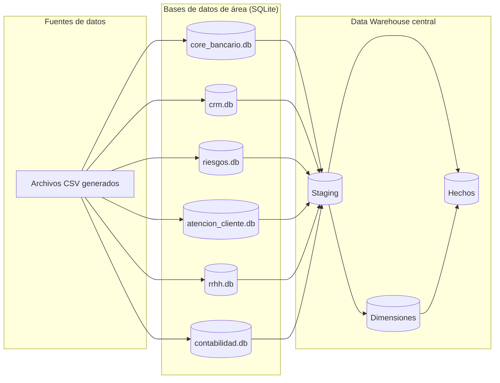
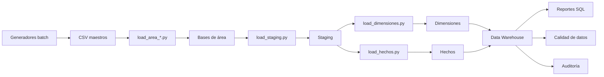

---
# 📄 Documentación Extendida del Proyecto Andes Banking AR

**Versión:** 2.0  
**Fecha:** 
**Autor:** AutodidactaJr  
**Etapa:** Data Warehouse on-premise con SQLite y Python

---

## 1. Resumen Ejecutivo

Andes Banking AR es un proyecto de ingeniería de datos que simula la construcción de un Data Warehouse para un banco tradicional argentino. El sistema integra datos de seis áreas departamentales (Core Bancario, CRM, Riesgos, Atención al Cliente, RRHH y Contabilidad) mediante procesos ETL implementados en Python y SQLite.

El proyecto incluye generación de datos sintéticos realistas con errores intencionales, cargas batch e incrementales diarias, limpieza y validación de calidad, modelado dimensional con SCD Tipo 2, auditoría ETL, y preparación para migración a la nube.

---

## 2. Objetivos

- Simular un entorno bancario realista con múltiples sistemas transaccionales.
- Construir un Data Warehouse central para análisis integrado.
- Dominar Python y SQL aplicados a ingeniería de datos.
- Practicar ETL, modelado dimensional, SCD Tipo 2, calidad de datos y automatización.
- Preparar el proyecto para evolucionar a la nube (AWS + Databricks).

---

## 3. Arquitectura General



---

## 4. Componentes Implementados

### 4.1 Generadores de Datos Sintéticos

Los generadores son scripts Python que producen archivos CSV con datos ficticios. Se dividen en dos tipos:

#### 4.1.1 Generadores batch (carga inicial)

Estos se ejecutan una sola vez para crear los datos maestros y transaccionales iniciales. Incluyen errores intencionales para practicar calidad de datos.

| Script | Entidad | Archivo CSV generado |
|--------|---------|----------------------|
| `generar_clientes.py` | Clientes | `clientes.csv` |
| `generar_sucursales.py` | Sucursales | `sucursales.csv` |
| `generar_cuentas.py` | Cuentas | `cuentas.csv` |
| `generar_tarjetas.py` | Tarjetas | `tarjetas.csv` |
| `generar_prestamos.py` | Préstamos | `prestamos.csv` |
| `generar_transacciones.py` | Transacciones | `transacciones.csv` |
| `generar_pagos.py` | Pagos | `pagos.csv` |
| `generar_campanas.py` | Campañas | `campanas.csv` |
| `generar_interacciones.py` | Interacciones | `interacciones.csv` |
| `generar_leads.py` | Leads | `leads.csv` |
| `generar_riesgos.py` | Riesgos (scoring, alertas, incidentes, morosidad) | Múltiples CSV |
| `generar_atencion_cliente.py` | Atención (tickets, llamadas, encuestas) | Múltiples CSV |
| `generar_rrhh.py` | RRHH (empleados, ausencias) | Múltiples CSV |
| `generar_contabilidad.py` | Contabilidad (cuentas, asientos, presupuesto) | Múltiples CSV |

#### 4.1.2 Generadores incrementales diarios

Un solo script `generar_diarios_area.py` que, con argumentos, genera solo los registros nuevos de cada día para cada área, respetando frecuencias:

| Frecuencia | Entidades |
|------------|-----------|
| Diario | clientes, transacciones, pagos, interacciones, leads, alertas, tickets, llamadas, encuestas, ausencias, asientos |
| Mensual (día 1) | scoring_crediticio, morosidad, empleados, presupuesto |
| Bajo demanda (probabilístico) | campañas, incidentes |

### 4.2 Bases de Datos de Área

Seis bases de datos SQLite simulan los sistemas transaccionales departamentales.

| Base de datos | Área | Tablas principales |
|---------------|------|---------------------|
| `core_bancario.db` | Core Bancario | clientes, cuentas, tarjetas, transacciones, préstamos, sucursales, pagos |
| `crm.db` | CRM/Marketing | campanas, interacciones, leads |
| `riesgos.db` | Riesgos | scoring_crediticio, alertas_fraude, incidentes, morosidad |
| `atencion_cliente.db` | Atención al Cliente | tickets, llamadas, encuestas |
| `rrhh.db` | RRHH | empleados, ausencias |
| `contabilidad.db` | Contabilidad | cuentas_contables, asientos_contables, presupuesto |

### 4.3 Data Warehouse Central

Base `andes_dw.db` con modelo dimensional (Kimball):

- **Dimensiones**: 12 tablas descriptivas.
- **Hechos**: 9 tablas de eventos medibles.
- **SCD Tipo 2** en `dim_cliente` y `dim_cuenta` para mantener histórico.

### 4.4 Procesos ETL

Scripts Python que mueven datos desde las bases de área al DW:

| Script | Función |
|--------|---------|
| `load_area_*.py` | Cargan CSVs batch a bases de área |
| `load_diarios_area.py` | Cargan archivos diarios incrementales a bases de área |
| `load_staging.py` | Extrae de bases de área y carga en staging |
| `load_dimensiones.py` | Limpia y carga dimensiones (SCD Tipo 2) |
| `load_hechos.py` | Carga hechos con integridad referencial |

### 4.5 Calidad de Datos

`calidad_datos.py` ejecuta reglas de validación y genera reporte CSV con problemas detectados (nulos, duplicados, formatos inválidos, referencias rotas).

### 4.6 Auditoría ETL

Tabla `etl_log` registra cada ejecución: script, fecha, filas procesadas, estado, mensaje.

### 4.7 Automatización

Archivo `run_daily_etl.bat` ejecuta el flujo diario completo. Programable con Task Scheduler de Windows.

---

## 5. Flujo de Datos Completo



---

## 6. Modelo de Datos Detallado

(Ver `docs/modelo_datos.md` para el detalle completo de tablas y columnas)

---

## 7. Estructura de Carpetas y Subcarpetas

A continuación se detalla cada carpeta y archivo del proyecto.

### 7.1 Raíz

```
andes-banking-ar/
│
├── data/
│   ├── raw/                         # Archivos CSV crudos generados
│   │   ├── core_bancario/           # Datos del Core Bancario
│   │   │   ├── clientes/            # Archivos diarios de clientes
│   │   │   │   ├── clientes.csv          (batch inicial)
│   │   │   │   ├── clientes_2026_08_17.csv (diario incremental)
│   │   │   │   └── ...
│   │   │   ├── sucursales/          # Archivos de sucursales
│   │   │   │   └── sucursales.csv
│   │   │   ├── cuentas/             # Archivos de cuentas
│   │   │   │   ├── cuentas.csv
│   │   │   │   └── ...
│   │   │   ├── tarjetas/            # Archivos de tarjetas
│   │   │   ├── prestamos/           # Archivos de préstamos
│   │   │   ├── transacciones/       # Archivos diarios de transacciones
│   │   │   ├── pagos/               # Archivos diarios de pagos
│   │   │   └── ...
│   │   ├── crm/                     # Datos CRM
│   │   │   ├── campanas/
│   │   │   ├── interacciones/
│   │   │   └── leads/
│   │   ├── riesgos/                 # Datos de Riesgos
│   │   │   ├── scoring_crediticio/
│   │   │   ├── alertas_fraude/
│   │   │   ├── incidentes/
│   │   │   └── morosidad/
│   │   ├── atencion_cliente/        # Datos de Atención al Cliente
│   │   │   ├── tickets/
│   │   │   ├── llamadas/
│   │   │   └── encuestas/
│   │   ├── rrhh/                    # Datos de RRHH
│   │   │   ├── empleados/
│   │   │   └── ausencias/
│   │   └── contabilidad/            # Datos de Contabilidad
│   │       ├── cuentas_contables/
│   │       ├── asientos_contables/
│   │       └── presupuesto/
│   │
│   ├── databases/                   # Bases de datos SQLite por área
│   │   ├── core_bancario.db
│   │   ├── crm.db
│   │   ├── riesgos.db
│   │   ├── atencion_cliente.db
│   │   ├── rrhh.db
│   │   └── contabilidad.db
│   │
│   ├── control/                     # Archivos de control (últimos IDs)
│   │   ├── ultimo_id_cliente.txt
│   │   ├── ultimo_id_transaccion.txt
│   │   └── ...
│   │
│   └── andes_dw.db                  # Data Warehouse central
│
├── sql/                             # Scripts SQL
│   ├── staging.sql                  # Creación de tablas staging
│   ├── dw_completo.sql              # Creación de dimensiones y hechos
│   ├── etl_log.sql                  # Tabla de auditoría
│   ├── indices.sql                  # Índices
│   ├── reportes_basicos.sql         # Consultas analíticas
│   └── esquemas_area/
│       ├── core_bancario.sql
│       ├── crm.sql
│       ├── riesgos.sql
│       ├── atencion_cliente.sql
│       ├── rrhh.sql
│       └── contabilidad.sql
│
├── python/
│   └── etl/                         # Scripts ETL
│       ├── load_area_core.py
│       ├── load_area_crm.py
│       ├── load_area_riesgos.py
│       ├── load_area_atencion.py
│       ├── load_area_rrhh.py
│       ├── load_area_contabilidad.py
│       ├── load_diarios_area.py
│       ├── load_staging.py
│       ├── load_dimensiones.py
│       ├── load_hechos.py
│       └── calidad_datos.py
│
├── src/
│   └── andes_bank/
│       ├── __init__.py
│       └── generators/
│           ├── __init__.py
│           ├── config.py
│           ├── utils.py
│           ├── generar_clientes.py
│           ├── generar_sucursales.py
│           ├── generar_cuentas.py
│           ├── generar_tarjetas.py
│           ├── generar_prestamos.py
│           ├── generar_transacciones.py
│           ├── generar_pagos.py
│           ├── generar_campanas.py
│           ├── generar_interacciones.py
│           ├── generar_leads.py
│           ├── generar_riesgos.py
│           ├── generar_atencion_cliente.py
│           ├── generar_rrhh.py
│           ├── generar_contabilidad.py
│           └── generar_diarios_area.py
│
├── docs/                            # Documentación
│   ├── modelo_datos.md
│   ├── documentacion_proyecto.md
│   └── documentacion_proyecto_extendida.md
│
└── run_daily_etl.bat                # Automatización diaria
```

### 7.2 Explicación de cada elemento

#### 7.2.1 Carpeta `data/raw/`

Contiene los archivos CSV generados. Cada área tiene una subcarpeta, y dentro de ella, una subcarpeta por entidad. Los archivos batch se guardan con el nombre de la entidad (ej. `clientes.csv`). Los archivos diarios incrementales llevan la fecha en el nombre (ej. `clientes_2026_08_19.csv`).

#### 7.2.2 Carpeta `data/databases/`

Almacena las bases de datos SQLite de cada área. Son los sistemas transaccionales simulados.

#### 7.2.3 Carpeta `data/control/`

Archivos de texto con el último ID generado para cada entidad. Permiten que los generadores diarios continúen sin duplicar IDs.

#### 7.2.4 Archivo `data/andes_dw.db`

Es el Data Warehouse central. Contiene las tablas de staging, dimensiones, hechos y auditoría.

#### 7.2.5 Carpeta `sql/`

Scripts SQL para crear tablas, índices, auditoría y reportes.

#### 7.2.6 Carpeta `python/etl/`

Scripts Python que ejecutan los procesos ETL. Cada `load_area_*.py` carga los CSV batch a la base de área correspondiente. `load_diarios_area.py` carga los archivos diarios. `load_staging.py`, `load_dimensiones.py` y `load_hechos.py` pueblan el DW.

#### 7.2.7 Carpeta `src/andes_bank/generators/`

Contiene los generadores de datos. `config.py` centraliza constantes y rutas. `utils.py` proporciona funciones auxiliares. Los generadores batch y el generador incremental están aquí.

#### 7.2.8 Carpeta `docs/`

Documentación del proyecto.

#### 7.2.9 Archivo `run_daily_etl.bat`

Lote que ejecuta el flujo diario completo: generadores incrementales, carga a bases de área y actualización del DW.

---

## 8. Lecciones Aprendidas

- Los generadores batch son útiles para carga inicial, pero generan duplicados si se ejecutan repetidamente.
- Las cargas incrementales requieren archivos de control para no repetir IDs.
- El staging aísla los datos crudos y permite limpiar antes del modelo dimensional.
- SCD Tipo 2 es fundamental para mantener histórico de cambios.
- La auditoría ETL da visibilidad y facilita debugging.

---

## 9. Próximos Pasos

- Conectar Power BI para visualización.
- Profundizar en consultas SQL analíticas.
- Migrar a AWS + Databricks para escalar.
- Implementar más reglas de calidad y alertas.
- Documentar jobs en SQL Server como comparativa.
- Preparar defensa del proyecto para entrevistas.

---

**Fin del documento**

---