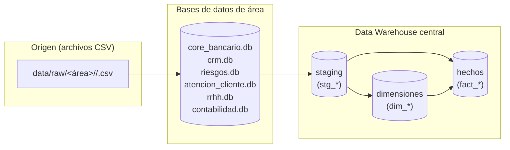

## 📄 Documento 4: Linaje de Datos — Andes Banking AR
---

# 🔗 Linaje de Datos — Andes Banking AR

**Versión:** 1.0  
**Fecha:** 
**Autor:** AutodidactaJr  
**Objetivo:** Documentar el recorrido de los datos desde las fuentes (bases de área) hasta el Data Warehouse central, mostrando transformaciones y relaciones.

---

## 1. Introducción

El **linaje de datos** describe el origen, movimiento, transformación y destino de los datos. En un banco real, es esencial para auditoría, gobernanza y solución de problemas.

En Andes Banking AR, el linaje se divide en dos grandes fases:

1. **Carga a bases de área** (CSV → bases transaccionales).  
2. **Integración al Data Warehouse** (bases de área → staging → dimensiones y hechos).

Este documento detalla ambos tramos.

---

## 2. Flujo general de linaje

---

## 3. Linaje por área

### 3.1 Core Bancario

#### CSV → base de área (`core_bancario.db`)

| Archivo CSV | Tabla destino | Script de carga |
|-------------|---------------|-----------------|
| `clientes.csv` | `clientes` | `load_area_core.py` |
| `sucursales.csv` | `sucursales` | `load_area_core.py` |
| `cuentas.csv` | `cuentas` | `load_area_core.py` |
| `tarjetas.csv` | `tarjetas` | `load_area_core.py` |
| `prestamos.csv` | `prestamos` | `load_area_core.py` |
| `transacciones.csv` | `transacciones` | `load_area_core.py` |
| `pagos.csv` | `pagos` | `load_area_core.py` |

#### Base de área → staging

| Tabla origen | Tabla staging | Script |
|--------------|---------------|--------|
| `clientes` | `stg_clientes` | `load_staging.py` |
| `sucursales` | `stg_sucursales` | `load_staging.py` |
| `cuentas` | `stg_cuentas` | `load_staging.py` |
| `tarjetas` | `stg_tarjetas` | `load_staging.py` |
| `prestamos` | `stg_prestamos` | `load_staging.py` |
| `transacciones` | `stg_transacciones` | `load_staging.py` |
| `pagos` | `stg_pagos` | `load_staging.py` |

#### Staging → dimensiones/hechos

| Staging | Tabla DW | Transformación principal |
|---------|----------|--------------------------|
| `stg_clientes` | `dim_cliente` | Limpieza, SCD2 |
| `stg_sucursales` | `dim_sucursal` | Limpieza fechas |
| `stg_cuentas` | `dim_cuenta` | Limpieza, SCD2, corrección selectiva de saldos |
| `stg_tarjetas` | `dim_tarjeta` | Obtención de SKs |
| `stg_transacciones` | `fact_transacciones` | SKs, descarte montos cero |
| `stg_pagos` | `fact_pagos` | SKs, corrección montos, entidad |

### 3.2 CRM

#### CSV → base de área (`crm.db`)

| CSV | Tabla | Script |
|-----|-------|--------|
| `campanas.csv` | `campanas` | `load_area_crm.py` |
| `interacciones.csv` | `interacciones` | `load_area_crm.py` |
| `leads.csv` | `leads` | `load_area_crm.py` |

#### Base → staging

| Origen | Staging | Script |
|--------|---------|--------|
| `campanas` | `stg_campanas` | `load_staging.py` |
| `interacciones` | `stg_interacciones` | `load_staging.py` |
| `leads` | `stg_leads` | `load_staging.py` |

#### Staging → DW

| Staging | Tabla DW | Transformación |
|---------|----------|----------------|
| `stg_campanas` | `dim_campana` | Carga directa |
| `stg_interacciones` | `fact_interacciones_campana` | SKs |
| `stg_leads` | `fact_leads` | SKs (cliente opcional) |

---

## 4. Linaje de columnas clave

### Clientes

| Columna origen | Tabla origen | Columna destino | Tabla destino | Transformación |
|----------------|--------------|-----------------|---------------|----------------|
| `id_cliente` | `stg_clientes` | `id_cliente_nk` | `dim_cliente` | Clave natural |
| `email` | `stg_clientes` | `email` | `dim_cliente` | Rellenar nulo |
| `fecha_nacimiento` | `stg_clientes` | `fecha_nacimiento` | `dim_cliente` | Convertir a YYYY-MM-DD |

### Cuentas

| Columna origen | Tabla origen | Columna destino | Tabla destino | Transformación |
|----------------|--------------|-----------------|---------------|----------------|
| `id_cuenta` | `stg_cuentas` | `id_cuenta_nk` | `dim_cuenta` | Clave natural |
| `saldo` | `stg_cuentas` | `saldo` | `dim_cuenta` | `ABS()` en cajas de ahorro negativas |
| `tipo_cuenta` | `stg_cuentas` | `tipo_cuenta` | `dim_cuenta` | Sin cambio |

### Transacciones

| Columna origen | Tabla origen | Columna destino | Tabla destino | Transformación |
|----------------|--------------|-----------------|---------------|----------------|
| `id_transaccion` | `stg_transacciones` | `id_transaccion_nk` | `fact_transacciones` | Clave natural |
| `monto` | `stg_transacciones` | `monto` | `fact_transacciones` | Descartar si es 0 |
| `id_cuenta` | `stg_transacciones` | `id_cuenta_sk` | `fact_transacciones` | Buscar en `dim_cuenta` |

---

## 5. Herramientas para mantener el linaje

En SQLite documentamos el linaje manualmente. En un entorno empresarial (SQL Server, Databricks), el linaje se obtiene automáticamente con:

- **SQL Server**: DMVs, triggers, SSIS lineage.
- **Databricks**: Unity Catalog (linaje automático).
- **Azure Purview** / **AWS Glue Data Catalog**.

---

## 6. Conclusión

El linaje de datos de Andes Banking AR es claro y trazable: cada tabla del Data Warehouse proviene de una fuente específica y pasa por transformaciones documentadas. Esto asegura transparencia, facilita auditorías y prepara la migración a herramientas de gobernanza avanzadas.

---

**Fin del documento**

---