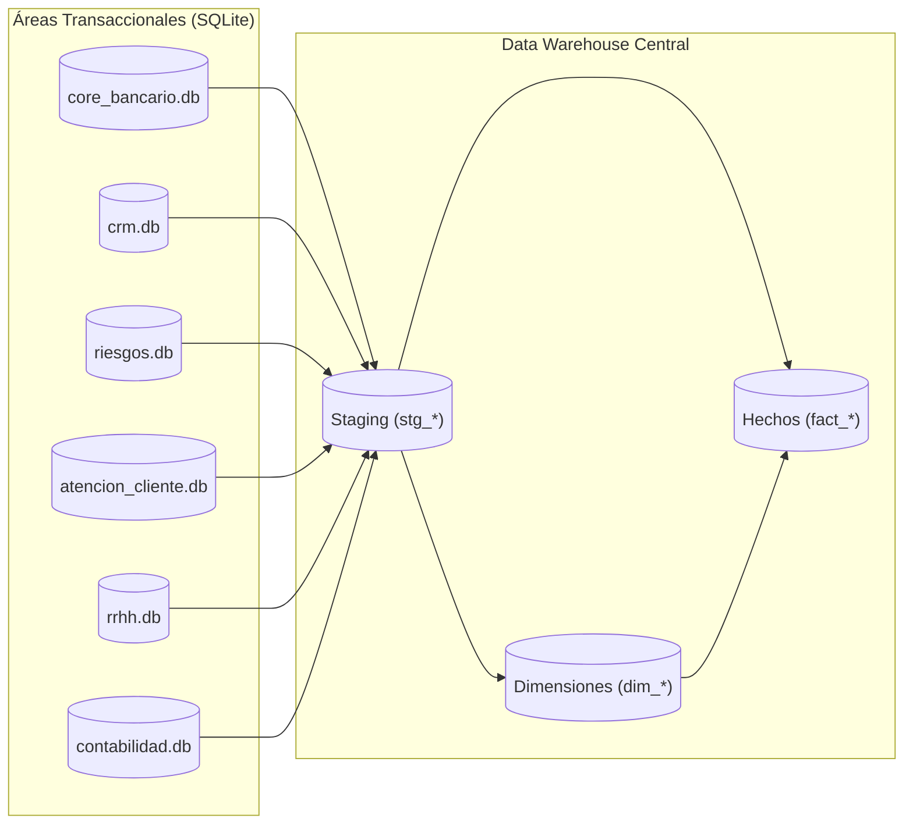

---

# 📊 Modelo de Datos — Andes Banking AR

**Versión:** 1.0  
**Fecha:**  
**Autor:** AutodidactaJr  
**Proyecto:** Andes Banking AR — Data Warehouse on-premise

---

## 1. Objetivo

Este documento describe la modelación de datos completa del proyecto **Andes Banking AR**: bases de datos transaccionales por área, staging, Data Warehouse central con modelo dimensional (Kimball), SCD Tipo 2 en dimensiones clave, y tablas auxiliares de auditoría y control.

---

## 2. Arquitectura general

---

## 3. Bases de datos transaccionales por área

Cada área tiene su propia base de datos SQLite que simula un sistema fuente. Los archivos CSV generados alimentan estas bases mediante scripts `load_area_*.py`.

### 3.1 Core Bancario (`core_bancario.db`)

| Tabla | Columnas principales | Descripción |
|-------|----------------------|-------------|
| `clientes` | id_cliente, tipo_doc, num_doc, nombre, apellido, email, telefono, fecha_nacimiento, direccion, ciudad, provincia, segmento | Datos maestros de clientes |
| `sucursales` | id_sucursal, nombre, direccion, ciudad, provincia, region, fecha_apertura | Sucursales bancarias |
| `cuentas` | id_cuenta, id_cliente, tipo_cuenta, moneda, saldo, fecha_apertura, estado, id_sucursal | Cuentas de clientes |
| `tarjetas` | id_tarjeta, id_cliente, id_cuenta, marca, tipo, numero, limite, fecha_emision, fecha_vencimiento, estado | Tarjetas de débito/crédito |
| `prestamos` | id_prestamo, id_cliente, tipo, monto, tasa_interes, plazo_meses, cuota, fecha_desembolso, saldo_pendiente, estado | Préstamos otorgados |
| `transacciones` | id_transaccion, id_cuenta, tipo_transaccion, monto, moneda, fecha, canal, estado, referencia | Movimientos de dinero |
| `pagos` | id_pago, id_cuenta, entidad, tipo_pago, monto, fecha, canal, estado, referencia | Pagos de servicios/tarjetas/préstamos |

### 3.2 CRM / Marketing (`crm.db`)

| Tabla | Columnas principales | Descripción |
|-------|----------------------|-------------|
| `campanas` | id_campana, nombre, canal, segmento_objetivo, fecha_inicio, fecha_fin, costo | Campañas de marketing |
| `interacciones` | id_interaccion, id_campana, id_cliente, fecha, tipo_interaccion, dispositivo | Interacciones de clientes con campañas |
| `leads` | id_lead, id_campana, id_cliente, fecha_creacion, estado, producto_interes | Clientes potenciales |

### 3.3 Riesgos (`riesgos.db`)

| Tabla | Columnas principales | Descripción |
|-------|----------------------|-------------|
| `scoring_crediticio` | id_scoring, id_cliente, score, riesgo, fecha_calculo | Score crediticio |
| `alertas_fraude` | id_alerta, id_cliente, id_cuenta, tipo_alerta, monto, estado, fecha_deteccion | Alertas de fraude |
| `incidentes` | id_incidente, id_cliente, descripcion, severidad, estado, fecha_incidente | Incidentes de seguridad |
| `morosidad` | id_morosidad, id_cliente, dias_mora, deuda_pendiente, fecha_reporte | Reportes de morosidad |

### 3.4 Atención al Cliente (`atencion_cliente.db`)

| Tabla | Columnas principales | Descripción |
|-------|----------------------|-------------|
| `tickets` | id_ticket, id_cliente, tipo_reclamo, descripcion, estado, fecha_creacion, fecha_resolucion | Tickets de atención |
| `llamadas` | id_llamada, id_cliente, duracion_seg, resultado, fecha_llamada | Llamadas de call center |
| `encuestas` | id_encuesta, id_cliente, satisfaccion, comentario, fecha_encuesta | Encuestas de satisfacción |

### 3.5 RRHH (`rrhh.db`)

| Tabla | Columnas principales | Descripción |
|-------|----------------------|-------------|
| `empleados` | id_empleado, nombre, apellido, cargo, id_sucursal, fecha_contratacion, salario | Empleados del banco |
| `ausencias` | id_ausencia, id_empleado, tipo_ausencia, dias, fecha_inicio, fecha_fin | Ausencias |

### 3.6 Contabilidad (`contabilidad.db`)

| Tabla | Columnas principales | Descripción |
|-------|----------------------|-------------|
| `cuentas_contables` | id_cuenta_contable, codigo_cuenta, descripcion, tipo_cuenta | Plan de cuentas |
| `asientos_contables` | id_asiento, id_cuenta_contable, fecha_contable, tipo_asiento, monto_debe, monto_haber, descripcion | Asientos contables |
| `presupuesto` | id_presupuesto, id_cuenta_contable, monto_presupuestado, fecha_presupuesto | Presupuesto |

---

## 4. Staging

La zona de staging está en la base de datos `andes_dw.db` y contiene tablas con prefijo `stg_*` que espejan las tablas de las áreas. Se utilizan para limpiar y validar antes de cargar las dimensiones y hechos.

Ejemplos: `stg_clientes`, `stg_cuentas`, `stg_transacciones`, `stg_tickets`, `stg_empleados`, etc.

Además existe la tabla de auditoría `etl_log`.

---

## 5. Data Warehouse Central (`andes_dw.db`)

### 5.1 Dimensiones

#### `dim_cliente` (SCD Tipo 2)

| Columna | Tipo | Descripción |
|---------|------|-------------|
| id_cliente_sk | INTEGER PK | Clave subrogada |
| id_cliente_nk | INTEGER | Clave natural (ID original) |
| tipo_doc, num_doc, nombre, apellido, email, telefono, fecha_nacimiento, direccion, ciudad, provincia, segmento | TEXT | Atributos descriptivos |
| fecha_inicio_vigencia | TEXT | Inicio de validez |
| fecha_fin_vigencia | TEXT | Fin de validez (NULL si es actual) |
| es_actual | INTEGER | 1 = actual, 0 = histórica |
| fecha_carga | TEXT | Fecha de inserción |

#### `dim_cuenta` (SCD Tipo 2)

| Columna | Tipo | Descripción |
|---------|------|-------------|
| id_cuenta_sk | INTEGER PK | Clave subrogada |
| id_cuenta_nk | INTEGER | Clave natural |
| id_cliente_sk | INTEGER FK → dim_cliente | Dueño de la cuenta |
| id_sucursal_sk | INTEGER FK → dim_sucursal | Sucursal de apertura |
| tipo_cuenta, moneda, fecha_apertura, estado | TEXT | Atributos |
| fecha_inicio_vigencia, fecha_fin_vigencia, es_actual | | SCD2 |
| fecha_carga | TEXT | |

#### `dim_tarjeta`

| Columna | Tipo | Descripción |
|---------|------|-------------|
| id_tarjeta_sk | INTEGER PK | |
| id_tarjeta_nk | INTEGER | |
| id_cliente_sk | INTEGER FK → dim_cliente | Cliente |
| id_cuenta_sk | INTEGER FK → dim_cuenta (nullable) | Cuenta asociada |
| marca, tipo, numero, limite, fecha_emision, fecha_vencimiento, estado | TEXT/REAL | |
| fecha_carga | TEXT | |

#### `dim_sucursal`

| Columna | Tipo | Descripción |
|---------|------|-------------|
| id_sucursal_sk | INTEGER PK | |
| id_sucursal_nk | INTEGER | |
| nombre, direccion, ciudad, provincia, region, fecha_apertura | TEXT | |
| fecha_carga | TEXT | |

#### `dim_canal`

| Columna | Tipo | Descripción |
|---------|------|-------------|
| id_canal_sk | INTEGER PK | |
| canal_nombre | TEXT UNIQUE | Home Banking, Mobile, etc. |

#### `dim_producto`

| Columna | Tipo | Descripción |
|---------|------|-------------|
| id_producto_sk | INTEGER PK | |
| producto_nombre | TEXT UNIQUE | |
| categoria | TEXT | |

#### `dim_tiempo`

| Columna | Tipo | Descripción |
|---------|------|-------------|
| id_tiempo_sk | INTEGER PK | |
| fecha | TEXT UNIQUE | YYYY-MM-DD |
| anio, mes, dia | INTEGER | |
| nombre_mes, nombre_dia_semana | TEXT | |

#### `dim_campana`

| Columna | Tipo | Descripción |
|---------|------|-------------|
| id_campana_sk | INTEGER PK | |
| id_campana_nk | INTEGER | |
| nombre, canal, segmento_objetivo, fecha_inicio, fecha_fin, costo | TEXT/REAL | |

#### `dim_empleado`

| Columna | Tipo | Descripción |
|---------|------|-------------|
| id_empleado_sk | INTEGER PK | |
| id_empleado_nk | INTEGER | |
| nombre, apellido, cargo | TEXT | |
| id_sucursal_sk | INTEGER FK → dim_sucursal | |
| fecha_contratacion, salario | TEXT/REAL | |

#### `dim_tipo_reclamo`

| Columna | Tipo | Descripción |
|---------|------|-------------|
| id_tipo_reclamo_sk | INTEGER PK | |
| tipo_reclamo_nombre | TEXT UNIQUE | |

#### `dim_tipo_riesgo`

| Columna | Tipo | Descripción |
|---------|------|-------------|
| id_tipo_riesgo_sk | INTEGER PK | |
| tipo_riesgo_nombre | TEXT UNIQUE | |

#### `dim_cuenta_contable`

| Columna | Tipo | Descripción |
|---------|------|-------------|
| id_cuenta_contable_sk | INTEGER PK | |
| codigo_cuenta | TEXT UNIQUE | |
| descripcion, tipo_cuenta | TEXT | |

### 5.2 Hechos

#### `fact_transacciones`

| Columna | Tipo | FK |
|---------|------|----|
| id_transaccion_sk | INTEGER PK | |
| id_transaccion_nk | INTEGER UNIQUE | |
| id_cliente_sk | INTEGER | → dim_cliente |
| id_cuenta_sk | INTEGER | → dim_cuenta |
| id_sucursal_sk | INTEGER nullable | → dim_sucursal |
| id_canal_sk | INTEGER | → dim_canal |
| id_tiempo_sk | INTEGER | → dim_tiempo |
| id_producto_sk | INTEGER nullable | → dim_producto |
| tipo_transaccion, moneda, estado, referencia | TEXT | |
| monto | REAL | |
| fecha_completa | TEXT | |

#### `fact_pagos`

| Columna | Tipo | FK |
|---------|------|----|
| id_pago_sk | INTEGER PK | |
| id_pago_nk | INTEGER UNIQUE | |
| id_cliente_sk | INTEGER | → dim_cliente |
| id_cuenta_sk | INTEGER nullable | → dim_cuenta |
| id_canal_sk | INTEGER | → dim_canal |
| id_tiempo_sk | INTEGER | → dim_tiempo |
| entidad, tipo_pago, estado, referencia | TEXT | |
| monto | REAL | |
| fecha_completa | TEXT | |

#### `fact_interacciones_campana`

| Columna | Tipo | FK |
|---------|------|----|
| id_interaccion_sk | INTEGER PK | |
| id_interaccion_nk | INTEGER UNIQUE | |
| id_campana_sk | INTEGER | → dim_campana |
| id_cliente_sk | INTEGER | → dim_cliente |
| id_tiempo_sk | INTEGER | → dim_tiempo |
| tipo_interaccion, dispositivo | TEXT | |
| fecha_completa | TEXT | |

#### `fact_leads`

| Columna | Tipo | FK |
|---------|------|----|
| id_lead_sk | INTEGER PK | |
| id_lead_nk | INTEGER UNIQUE | |
| id_campana_sk | INTEGER | → dim_campana |
| id_cliente_sk | INTEGER nullable | → dim_cliente |
| id_tiempo_sk | INTEGER | → dim_tiempo |
| estado, producto_interes | TEXT | |
| fecha_creacion | TEXT | |

#### `fact_reclamos`

| Columna | Tipo | FK |
|---------|------|----|
| id_reclamo_sk | INTEGER PK | |
| id_reclamo_nk | INTEGER UNIQUE | |
| id_cliente_sk | INTEGER | → dim_cliente |
| id_sucursal_sk | INTEGER nullable | → dim_sucursal |
| id_tipo_reclamo_sk | INTEGER | → dim_tipo_reclamo |
| id_tiempo_sk | INTEGER | → dim_tiempo |
| estado, resolucion_dias | TEXT/INTEGER | |
| fecha_creacion, fecha_resolucion | TEXT | |

#### `fact_ausencias`

| Columna | Tipo | FK |
|---------|------|----|
| id_ausencia_sk | INTEGER PK | |
| id_ausencia_nk | INTEGER UNIQUE | |
| id_empleado_sk | INTEGER | → dim_empleado |
| id_sucursal_sk | INTEGER nullable | → dim_sucursal |
| id_tiempo_sk | INTEGER | → dim_tiempo |
| tipo_ausencia, dias | TEXT/INTEGER | |
| fecha_inicio, fecha_fin | TEXT | |

#### `fact_scoring_crediticio`

| Columna | Tipo | FK |
|---------|------|----|
| id_scoring_sk | INTEGER PK | |
| id_scoring_nk | INTEGER UNIQUE | |
| id_cliente_sk | INTEGER | → dim_cliente |
| id_tiempo_sk | INTEGER | → dim_tiempo |
| score, riesgo | INTEGER/TEXT | |
| fecha_calculo | TEXT | |

#### `fact_alertas_fraude`

| Columna | Tipo | FK |
|---------|------|----|
| id_alerta_sk | INTEGER PK | |
| id_alerta_nk | INTEGER UNIQUE | |
| id_cliente_sk | INTEGER | → dim_cliente |
| id_cuenta_sk | INTEGER nullable | → dim_cuenta |
| id_tipo_riesgo_sk | INTEGER | → dim_tipo_riesgo |
| id_tiempo_sk | INTEGER | → dim_tiempo |
| tipo_alerta, estado | TEXT | |
| monto | REAL | |
| fecha_deteccion | TEXT | |

#### `fact_asientos_contables`

| Columna | Tipo | FK |
|---------|------|----|
| id_asiento_sk | INTEGER PK | |
| id_asiento_nk | INTEGER UNIQUE | |
| id_cuenta_contable_sk | INTEGER | → dim_cuenta_contable |
| id_tiempo_sk | INTEGER | → dim_tiempo |
| id_sucursal_sk | INTEGER nullable | → dim_sucursal |
| tipo_asiento, descripcion | TEXT | |
| monto_debe, monto_haber | REAL | |
| fecha_contable | TEXT | |

---

## 6. Tabla de auditoría `etl_log`

| Columna | Tipo | Descripción |
|---------|------|-------------|
| id_log | INTEGER PK | |
| script | TEXT | Nombre del script ejecutado |
| fecha_ejecucion | TEXT | Fecha y hora |
| filas_afectadas | INTEGER | Registros procesados |
| estado | TEXT | INICIO, EXITO, ERROR |
| mensaje | TEXT | Detalle |

---

## 7. Archivos de control para generación incremental

Se guardan en `data/control/` (ej. `ultimo_id_cliente.txt`, `ultimo_id_transaccion.txt`, etc.). Cada archivo contiene el último ID generado por entidad, permitiendo que los generadores diarios continúen sin duplicar.

---

## 8. Resumen de capas

| Capa | Elementos | Propósito |
|------|-----------|-----------|
| Áreas transaccionales | 6 bases SQLite | Simular sistemas fuente |
| Staging | tablas `stg_*` en `andes_dw.db` | Datos crudos para limpieza |
| Data Warehouse | 12 dimensiones + 9 hechos | Modelo dimensional para análisis |
| Auditoría | `etl_log` | Registro de ejecuciones |
| Control | `ultimo_id_*.txt` | Coordinar generación incremental |

---

## 9. Conclusión

El modelo de datos implementado refleja una arquitectura completa y realista: múltiples fuentes, integración en un Data Warehouse central con modelado dimensional, manejo de histórico con SCD Tipo 2, y soporte para cargas incrementales y auditoría. Esta base está lista para análisis, visualización y futura migración a la nube.

---

**Fin del documento**

---

Copia este contenido en un archivo llamado `docs/modelo_datos.md`. Si quieres, puedo ayudarte a generar un diagrama actualizado en draw.io o Mermaid a partir de este documento.

¿Qué te gustaría hacer ahora? Podemos continuar con la **visualización en Power BI**, practicar **consultas analíticas** o preparar la **migración a la nube**. Tú decides.